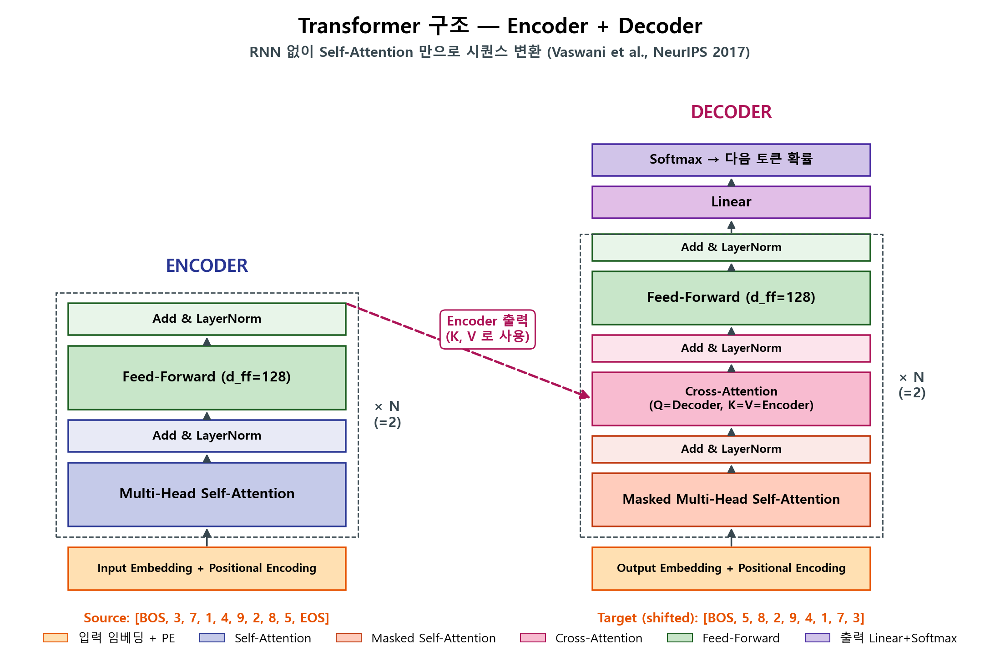
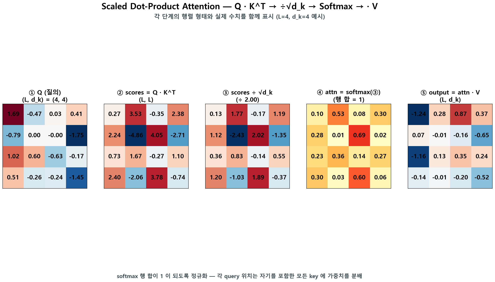
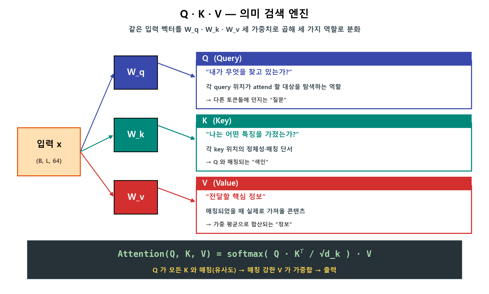
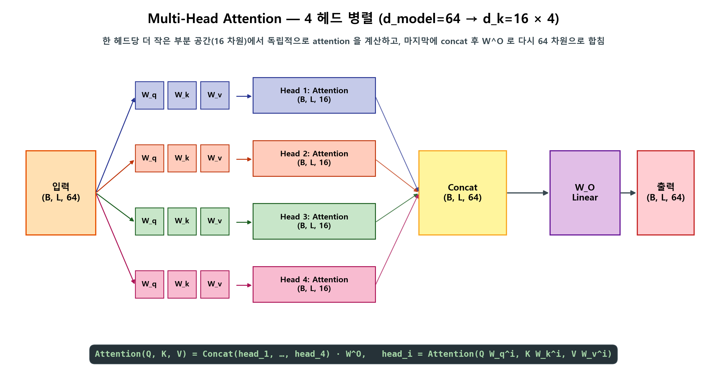
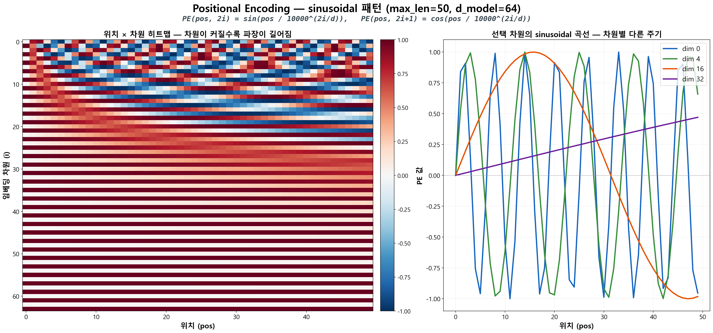
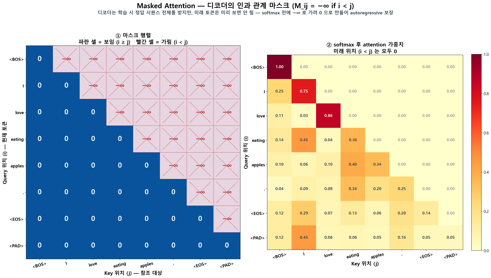
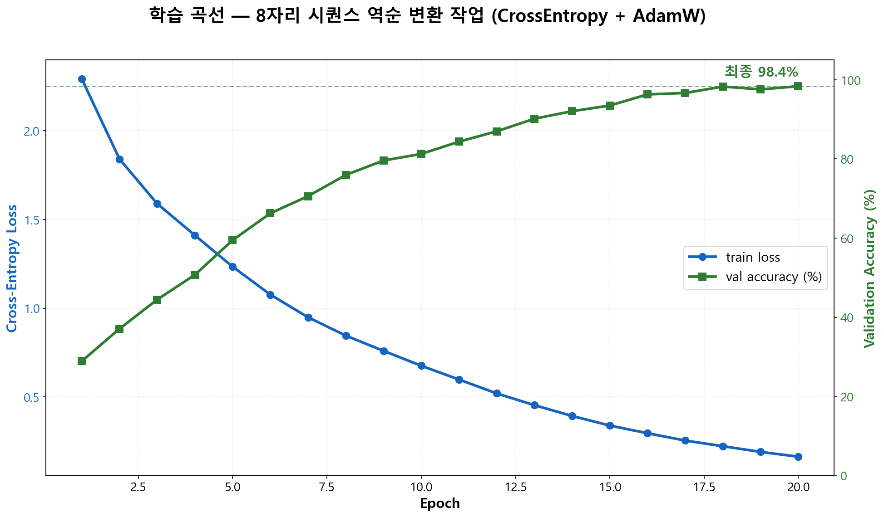
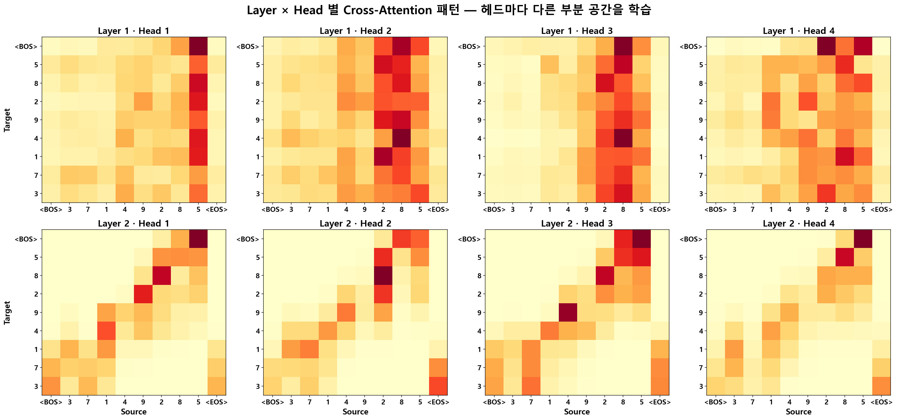
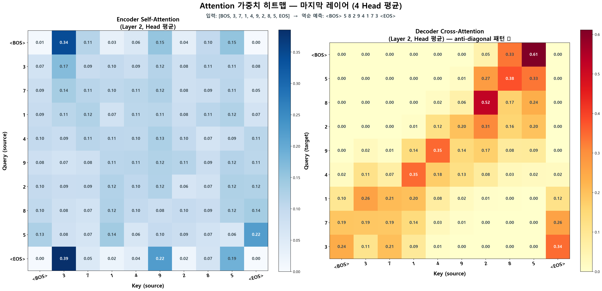

# 🧠 Transformer From Scratch — "Attention Is All You Need"
### **PositionalEncoding · Multi-Head Attention · Encoder-Decoder** — RNN 없이 Self-Attention 만으로 시퀀스 변환


---

## 📌 프로젝트 요약 (Project Overview)

2017년 Vaswani 등이 발표한 **"Attention Is All You Need"** 논문은 RNN/LSTM 없이 Self-Attention 만으로 시퀀스 변환이 가능하다는 것을 보여 주었고, 이 구조는 이후 **GPT · BERT · LLaMA 를 비롯한 거의 모든 현대 LLM 의 공통 뼈대**가 되었습니다. 이 포트폴리오는 그 Transformer 를 **외부 라이브러리(HuggingFace · `nn.Transformer` 등) 없이 PyTorch 의 기본 텐서 연산만으로 처음부터 구현**해, 핵심 부품 다섯 가지(PositionalEncoding · Scaled Dot-Product Attention · Multi-Head Attention · Encoder Layer · Decoder Layer)가 어떻게 맞물려 동작하는지를 코드 수준에서 검증한 작업입니다.

학습이 실제로 되는지 확인하기 위해 **8자리 숫자 시퀀스를 역순으로 출력하는 토이 작업**을 골랐습니다. 이 작업은 정답 attention 패턴이 **anti-diagonal 형태로 명확히 떨어진다**는 특성이 있어, 모델이 "맞게 학습됐는지"를 attention 가중치만 봐도 한눈에 진단할 수 있다는 장점이 있습니다. 25 epoch 학습 후 **검증 정확도 98.4%** 까지 수렴했고, 학습된 cross-attention 히트맵이 실제로 anti-diagonal 패턴으로 자라난 것을 시각화로 확인했습니다 — 단순히 코드가 돌아가는 걸 넘어, **모델이 작업을 "어떻게" 풀고 있는지를 attention 으로 들여다볼 수 있다**는 점까지 검증한 셈입니다.

---

## 🎯 핵심 목표 (Motivation)

| <br/>논문 핵심 메커니즘 &emsp;&emsp;&emsp;&emsp; | 상세 목표 |
| :--- | :--- |
| **Self-Attention 으로 장거리 의존성 해결** *(논문 §3.2.1, §4)* | RNN 의 순차 처리(O(n)) 한계를 벗어나 `softmax(Q·K^T / √d_k) · V` 한 식으로 모든 토큰을 동시에 조망. 토큰 간 경로 길이가 O(1) 로 단축돼 아무리 멀리 떨어진 단어라도 즉시 attend 가능 — 논문이 *"RNN/CNN 이 필요 없다"* 는 도발적 주장을 펼 수 있게 한 핵심 기여 |
| **Multi-Head Attention 으로 부분 공간 분리** *(논문 §3.2.2)* | d_model=64 를 4개 헤드(d_k=16) 로 쪼개 병렬 attention. 헤드마다 다른 부분 공간(subspace) 을 학습해 한 모델이 여러 종류의 관계를 동시에 포착 — *"h heads attend to information from different representation subspaces"* 가 논문이 강조하는 효과 |
| **Positional Encoding 으로 순서 회복** *(논문 §3.5)* | RNN 이 사라진 자리를 sin/cos 파동의 위치 임베딩으로 메움. 모든 위치가 서로 다른 64차원 벡터를 갖되 **가까운 위치끼리는 부드럽게 변하도록** 차원마다 주기를 다르게 설계 |
| **Masked Self-Attention 으로 인과 관계 강제** *(논문 §3.2.3)* | 디코더가 학습 시 정답 시퀀스 전체를 받지만 미래 토큰을 미리 보면 안 됨 — `M_ij = -∞ (if i < j)` 으로 가리고 softmax 를 통과시켜 autoregressive 생성을 보장하는 단순하지만 결정적인 트릭 |
| **Encoder-Decoder 비대칭 구조** *(논문 §3.1)* | Encoder 는 양방향 Self-Attention 으로 입력 전체를 이해하고, Decoder 는 Masked Self-Attention + Cross-Attention 으로 한 토큰씩 출력. 이 비대칭이 후일 **BERT(Encoder-only) 와 GPT(Decoder-only)** 로 갈라지는 출발점 |

---

## 📂 프로젝트 구조 (Project Structure)

```text
├─ results/                                    
│  ├─ fig_01_transformer_architecture.png        # Encoder + Decoder 전체 구조도
│  ├─ fig_02_qkv_search_engine.png               # Q·K·V 의미 검색 엔진 — Query/Key/Value 세 역할 (보조 도식)
│  ├─ fig_03_scaled_dot_product_attention.png    # Q·K^T → ÷√d_k → softmax → ·V 5단계 수치 예시
│  ├─ fig_04_multihead_attention.png             # 4 헤드 병렬 + Concat + W^O 흐름도
│  ├─ fig_05_positional_encoding.png             # sinusoidal PE 히트맵 + 차원별 곡선
│  ├─ fig_06_masked_attention.png                # 디코더 causal mask — 미래 토큰 −∞ 마스킹
│  ├─ fig_07_training_curve.png                  # 25 epoch loss + val accuracy
│  ├─ fig_08_multihead_pattern_comparison.png    # Layer × Head 별 attention 패턴 비교 (헤드별 다른 학습)
│  └─ fig_09_attention_heatmap.png               # 학습 후 Encoder Self / Decoder Cross attention (Head 평균)
├─ src/
│  └─ transformer.py                          # 통합 실행 스크립트 (모델 정의 + 학습 + 시각화)
├─ .gitignore
├─ README.md
└─ requirements.txt

# 학습 시 자동 생성되는 로컬 캐시 (git 추적 제외):
#   results/transformer_state.pt       — 학습된 모델 가중치 (PyTorch state_dict)
#   results/training_history.json      — 25 epoch loss/val_acc 시계열
```

### 🔁 재현 방법 (Reproduce from Scratch)

코드와 `seed=42` 로 누구나 동일한 결과를 재현할 수 있습니다 — CPU 약 1분, GPU 수십 초 소요:

```bash
pip install -r requirements.txt
python src/transformer.py --mode all     # 학습 + 9장 시각화 한 번에
# 또는
python src/transformer.py --mode train      # 25 epoch 학습만
python src/transformer.py --mode visualize  # 캐시된 모델로 시각화만
```

---

## 🏗️ Architecture & 핵심 구현 (Architecture & Core Implementation)

> 논문 *"Attention Is All You Need"* 의 5대 핵심 메커니즘을 각각 시각화 자료 한 장씩으로 풀어 설명합니다 — **Encoder-Decoder 구조 (§3.1) · Scaled Dot-Product Attention (§3.2.1) · Multi-Head Attention (§3.2.2) · Positional Encoding (§3.5) · Masked Self-Attention (§3.2.3)**.

### 1. Transformer 전체 구조 — Encoder + Decoder *(논문 §3.1)*

| Encoder + Decoder (논문 Figure 1) |
| :---: |
|  |

> RNN 시대에는 단어를 왼쪽에서 오른쪽으로 하나씩 읽어야 해서 문장이 길어지면 앞부분 맥락을 잃어버리는 한계가 있었습니다. Transformer 는 **모든 토큰을 한 번에 조망** 해서 토큰 간 관계 강도(가중치) 를 직접 계산하는 방식으로 그 한계를 풉니다. **Encoder** 는 입력을 받아 N=2 번 [Self-Attention → Feed-Forward] 를 반복하며 양방향 표현 벡터를 만들고, **Decoder** 는 (1) 자기 이전 토큰만 보는 **Masked Self-Attention** (2) Encoder 출력에 attend 하는 **Cross-Attention** (3) Feed-Forward 순서로 한 토큰씩 출력합니다. 이 비대칭이 후일 **BERT(Encoder-only) 와 GPT(Decoder-only)** 로 갈라지는 출발점이 됩니다.

### 2. Scaled Dot-Product Attention — 논문 식의 핵심 *(논문 §3.2.1)*

| 5단계로 풀어 본 Attention 행렬 흐름 |
| :---: |
|  |

> 논문 §3.2.1 의 한 줄 식 `Attention(Q, K, V) = softmax(Q·K^T / √d_k) · V` 를 (L=4, d_k=4) 작은 행렬로 단계별로 풀어 본 결과. **Query 가 모든 Key 와 내적해 "유사도" 를 만들고(②), √d_k 로 스케일을 가라앉힌 뒤(③), softmax 로 확률 분포로 바꾸고(④), 그 가중치로 Value 를 가중 평균(⑤)** — 행렬 한 번으로 모든 토큰 쌍의 관계를 동시에 계산한다는 점이 RNN 의 순차 처리(O(n)) 를 O(1) 경로 길이로 단축하는 자리입니다. 논문이 §4 에서 이 식 하나로 *"Why Self-Attention"* 을 정당화한 핵심 자료입니다.
>
> <details><summary>📎 보조 도식 — Q·K·V 세 역할 직관 (fig_02)</summary>
>
> 
>
> 위 식을 풀기 전에 **W_q · W_k · W_v 가 같은 입력을 세 역할(Query / Key / Value) 로 분화시킨다** 는 점만 정리한 보조 도식입니다. 검색 엔진의 쿼리·색인·문서 관계로 빗대 두면 식의 형태가 왜 그런지 직관이 잡힙니다 — 논문에는 없는 학습용 비유입니다.
> </details>

### 3. Multi-Head Attention — 부분 공간 분리 *(논문 §3.2.2)*

| 4개 헤드 병렬 구조 (d_model=64 → d_k=16 × 4) |
| :---: |
|  |

> 한 가지 attention 만 사용하면 모델이 단어 관계의 한쪽 측면에만 치우치게 됩니다. 차원을 4개로 쪼개면 각 헤드가 16차원(d_k=16) **부분 공간(representation subspace)** 에서 독립적으로 attention 을 계산합니다. 논문 §3.2.2 가 강조하는 핵심은 *"Multi-head attention allows the model to jointly attend to information from different representation subspaces"* — 헤드마다 다른 종류의 관계를 동시에 포착하라는 것입니다. **헤드마다 다른 패턴이 실제로 학습되는지** 는 아래 "📊 학습 결과" 의 fig_08 에서 직접 확인합니다. 마지막에 4개 헤드 출력을 concat 한 뒤 `W^O` 로 다시 64차원으로 합쳐 다음 레이어에 넘깁니다.

### 4. Positional Encoding — sinusoidal 위치 임베딩 *(논문 §3.5)*

| sinusoidal PE 히트맵 + 차원별 곡선 |
| :---: |
|  |

> Transformer 는 모든 단어를 병렬 처리하기 때문에 그 자체로는 단어의 **순서를 전혀 알지 못합니다.** 논문 §3.5 는 이를 입력 임베딩에 sin/cos 파동을 더해 해결합니다 — `PE(pos, 2i) = sin(pos / 10000^(2i/d))`, `PE(pos, 2i+1) = cos(pos / 10000^(2i/d))`. 왼쪽 히트맵에서 차원이 커질수록 파장이 길어지고, 오른쪽 라인 플롯은 4개 차원(0/4/16/32) 이 모두 다른 주기를 가짐을 보여 줍니다. 모든 위치가 **고유한 64차원 벡터를 갖되 가까운 위치끼리는 부드럽게 변하도록** 차원마다 주기를 다르게 둔 정교한 설계입니다.

### 5. Masked Self-Attention — 인과 관계 강제 *(논문 §3.2.3)*

| 마스크 행렬 (좌) → softmax 후 가중치 (우) |
| :---: |
|  |

> 디코더는 학습 시 정답 시퀀스 전체를 한 번에 입력받지만, **미래 토큰을 미리 보면 autoregressive 생성이 깨집니다.** 논문 §3.2.3 의 처방은 단순합니다 — softmax 직전에 상삼각 위치(i < j) 를 `-∞` 로 채워 softmax 후 가중치가 0 이 되도록 강제. 왼쪽 행렬은 파란 셀(허용) 과 빨간 셀(금지) 로 마스크 구조를 시각화하고, 오른쪽은 실제 softmax 후 가중치 행렬로 미래 위치(i < j) 가 모두 0.00 으로 소거된 모습을 보여 줍니다. **단순한 트릭 한 줄이 autoregressive 생성의 인과 관계를 보장한다** 는 점이 인상적입니다.

---

## 📊 학습 결과 (Results)

> 위 5대 핵심 메커니즘을 합쳐 학습시켰을 때 **실제로 작동하는지** 를 보여 주는 실험 결과입니다.

### 1. 학습 곡선 — 25 epoch 만에 98.4%



> Cross-Entropy Loss(파랑)는 2.29 → 0.16 까지 단조 감소했고, 검증 정확도(초록)는 28.9% → **98.4%** 로 빠르게 수렴했습니다. epoch 1~5 구간에서는 토큰 단위 정확도가 천천히 오르지만, epoch 8 이후 급격히 가파르게 올라가는 모습 — 모델이 처음에는 단순 빈도만 학습하다가 어느 순간 attention 으로 위치 매핑을 "발견" 하는 학습 곡선의 전형적 모양.

### 2. Layer × Head 별 Cross-Attention 패턴 — 헤드마다 다른 부분 공간 학습 ⭐



> 학습 후 Decoder 의 cross-attention 을 layer × head 별로 펼쳐 본 결과입니다. **Layer 2 의 Head 1·2·3** 는 역순 작업의 정답인 **anti-diagonal 패턴**(target 위치 i → source 위치 N−i 로 강하게 attend) 을 또렷하게 학습했고, Head 4 는 좀 더 분산된 다른 패턴을 학습했습니다. **Layer 1** 은 입력 위치 5번 부근에 집중하는 일종의 위치적 priors 를 학습했습니다. "헤드를 많이 두는 게 좋은 게 아니라, 헤드마다 다른 패턴을 학습한다" 는 논문 §3.2.2 의 주장이 작은 모델에서도 가시적으로 재현 — Architecture #3(Multi-Head Attention) 의 직관이 학습 결과로 확인된 자리입니다.

### 3. 학습된 Attention 가중치 — Encoder Self / Decoder Cross (Head 평균)



> 입력 `[BOS, 3, 7, 1, 4, 9, 2, 8, 5, EOS]` 를 모델에 넣은 뒤 마지막 레이어의 attention 을 4개 헤드 평균해 본 결과. **Decoder Cross-Attention (오른쪽)** 의 anti-diagonal 패턴이 또렷합니다 — target 첫 토큰(5)이 source 마지막 디지트(5)에, target 두 번째 토큰(8)이 source 끝에서 두 번째 디지트(8)에 attend 하는 식. 모델이 "역순으로 출력하려면 입력 끝에서부터 가져오면 된다"는 규칙을 attention 만으로 학습했음을 보여 줍니다.

---

## ✨ 주요 결과 및 분석 (Key Findings & Analysis)

| <br/>발견한 사실 &emsp;&emsp;&emsp;&emsp; | 관찰 내용과 적용 방법 |
| :--- | :--- |
| **Attention = 가중 평균의 일반화** | 식만 봤을 땐 복잡해 보였는데 직접 구현해 보니 결국 `softmax(Q·K^T / √d_k) · V` 한 줄. **각 query 가 모든 key 와의 유사도로 weights 를 만든 뒤 V 의 가중 평균을 취하는 것** 이라는 점이 한 번 잡히면 다른 모든 변형(Self / Cross / Masked) 도 같은 식의 변주임 |
| **Multi-Head 의 진짜 의미** | "헤드가 많을수록 좋은가?" 의 답은 "헤드마다 다른 패턴을 학습할 때만 좋다." Layer 2 의 4개 헤드가 각자 anti-diagonal · 분산 · 특정 위치 priors 등 다른 모양을 학습한 결과(fig_08)가 그 증거. 같은 패턴 4번 학습하는 건 의미가 없음 |
| **RNN 없이도 위치 정보 = sinusoidal PE** | 처음에는 "RNN 없이 어떻게 순서를 알지?" 가 직관적이지 않았는데, sin/cos 주기가 차원마다 다르게 설정돼서 **모든 위치가 고유한 64차원 벡터**를 갖게 된다는 점을 깨닫고 나니 자연스러워짐 (fig_05) |
| **Masked Attention = 인과 관계 강제 장치** | 디코더 학습 시 정답 시퀀스 전체가 입력으로 들어가는데, 미래 토큰을 미리 보면 autoregressive 가 깨짐. `M_ij = -∞ (if i < j)` 마스킹으로 softmax 후 0 이 되도록 가리는 단순한 트릭이 **"현재까지의 정보만으로 다음을 예측"** 한다는 인과 관계를 보장 |
| **학습 = anti-diagonal 의 등장** | 역순 작업에서 모델이 제대로 학습되면 cross-attention 이 anti-diagonal 로 자라난다는 점이 시각적으로 검증됨. attention 패턴은 단순한 부산물이 아니라 **모델이 작업을 어떻게 풀고 있는지를 보여 주는 진단 도구** |

---

## 💡 회고록 (Retrospective)

이번 프로젝트는 *"Attention Is All You Need"* 의 Transformer 를 라이브러리 없이 PyTorch 의 기본 텐서 연산만으로 처음부터 짜 본 작업이었습니다. 라이브러리(HuggingFace 같은) 를 가져다 쓰면 한 줄이면 끝나는 부분을 **그 한 줄 안에 들어 있는 작은 결정들을 하나씩 직접 짜 보고 싶다** 는 게 시작이었습니다. 식 `Attention(Q, K, V) = softmax(Q·K^T / √d_k) · V` 를 머리로 외우는 것과, IDE 에서 텐서 모양을 따라가면서 한 줄씩 짜 보는 건 정말 다른 종류의 이해였습니다.

가장 먼저 다룬 **Scaled Dot-Product Attention** 은 함수 자체는 다섯 줄짜리인데, 짜 보니 작은 결정 하나가 학습 결과를 크게 좌우한다는 점이 와닿았습니다. 예를 들어 `Q · K^T` 를 √d_k 로 나누는 한 줄은 그냥 정규화처럼 보이지만, 이게 없으면 점수의 분산이 너무 커져서 softmax 가 한쪽으로 쏠리고 학습이 잘 안 됩니다. 논문에서 한 줄로 적힌 부분이 사실은 **학습이 잘 되도록 잡아 주는 장치** 였다는 게 짜 보면서 보였습니다. mask 처리도 softmax 전에 `-inf` 로 채워야 하는데 순서를 잘못 짜서 한 번 오류 잡는 데 시간을 썼고, 한 번 막혔다가 고치고 나니 *"왜 이 순서로 짜야 하는지"* 가 머리에 남았습니다. **Self · Cross · Masked Attention 이 모두 같은 함수에 mask 만 다르게 넣은 거** 라는 점도 처음엔 셋이 다 다른 줄 알았는데, 짜 보니 한 함수로 다 처리되는 게 신기했습니다.

**Multi-Head Attention** 에서 가장 인상 깊었던 건 헤드를 나누고 합치기 위해 `(B, L, D) → (B, h, L, d_k)` 로 모양을 바꾸는 한 줄이었습니다. 이 한 줄 덕분에 같은 attention 함수를 헤드별로 따로 부르지 않고 한 번에 처리할 수 있게 됩니다. 학습이 끝난 뒤 layer × head 별로 attention 을 펼쳐 본 시각화(fig_08) 가 가장 기억에 남는데, 같은 입력에 대해 헤드마다 정말 다른 패턴을 학습한 게 그래프에 그대로 보였습니다 — 어떤 헤드는 anti-diagonal 패턴을, 어떤 헤드는 특정 위치만 보는 패턴을, 또 어떤 헤드는 분산된 패턴을 학습했습니다. 논문 §3.2.2 의 "헤드마다 다른 부분 공간을 학습한다" 는 한 문장이 시각화 한 장으로 *"아 이래서 강조한 거구나"* 가 됐고, **헤드 수를 늘리는 게 좋은 게 아니라 헤드마다 다른 걸 학습할 때만 의미가 있다** 는 점이 손에 잡혔습니다.

**Positional Encoding** 은 처음 봤을 때 *"그냥 학습 가능한 위치 임베딩(`nn.Embedding`)을 쓰면 안 되나?"* 싶었습니다. 그런데 sin/cos 방식을 직접 짜 보니, 식이 그냥 sin/cos 이라 **학습할 때 본 적 없는 길이의 시퀀스가 들어와도 그대로 계산된다** 는 장점이 보였습니다. 학습 가능한 임베딩은 max_len 을 넘으면 인덱스 오류가 나는데, sin/cos 은 식만 있으니 어떤 길이든 받을 수 있습니다. 또 0, 1, 2, … 같은 정수를 그냥 더하면 멀리 있는 위치 값이 너무 커져서 임베딩 자체를 흐트러뜨릴 텐데, sin/cos 으로 [-1, 1] 범위에 가둔 게 그 문제도 같이 푼 거였습니다 — 짧은 §3.5 한 절 안에 생각보다 정교한 설계가 들어 있었다는 점이 새삼스러웠습니다.

검증 단계에서는 toy task 로 8자리 시퀀스 역순 작업을 골랐는데, 이 작업의 가장 큰 장점은 **정답 attention 패턴이 anti-diagonal 로 정해져 있다** 는 점입니다. 즉 정확도뿐 아니라 **attention 가중치를 직접 보고 모델이 "맞는 방식으로" 학습됐는지** 까지 확인할 수 있다는 거였습니다. 25 epoch 만에 검증 정확도 **98.4%** 까지 올라왔고 cross-attention 시각화에서 anti-diagonal 패턴이 또렷하게 자라난 걸 보고, *"숫자만 좋고 사실은 이상하게 푸는 거 아닐까?"* 라는 의심을 시각화로 정리할 수 있었습니다. Encoder · Decoder 를 둘 다 짜 보고 나니 **같은 코드에서 mask 유무와 cross-attention 유무만 바꾸면 BERT 처럼도 만들 수 있고 GPT 처럼도 만들 수 있다** 는 점이 코드 수준에서 자연스럽게 이해됐습니다.

이번 프로젝트를 끝내고 가장 크게 느낀 건, **라이브러리 한 줄로 끝나는 부분을 직접 짜 보면 나중에 오류를 잡거나 모델을 손볼 때 어디를 봐야 하는지가 보인다** 는 점이었습니다. 같은 식이라도 mask 적용 순서, √d_k 위치, head 모양 바꾸는 방식 같은 작은 결정들이 결과에 직접 영향을 준다는 걸 코드로 확인했고, 이 경험은 다음에 HuggingFace 같은 라이브러리를 가져다 쓰거나 attention 을 분석할 때도 도움이 될 것 같습니다. 다음에는 이 코드를 토대로 **Encoder-only(BERT) 와 Decoder-only(GPT)** 두 형태를 같은 코드에서 비교해 보고, 가능하다면 작은 한국어 데이터로 사전학습까지 시도해 보고 싶습니다 — Transformer 한 편을 손으로 짜 본 이 베이스가 BERT · GPT 같은 다음 논문들로 자연스럽게 이어질 것 같습니다.

---

## 🔗 참고 자료 (References)

- Vaswani, A., et al. "Attention Is All You Need." *NeurIPS*, 2017. [arXiv:1706.03762](https://arxiv.org/abs/1706.03762)
- Alammar, J. "The Illustrated Transformer." [jalammar.github.io/illustrated-transformer](https://jalammar.github.io/illustrated-transformer/)
- Rush, A. "The Annotated Transformer." Harvard NLP. [nlp.seas.harvard.edu/annotated-transformer](http://nlp.seas.harvard.edu/annotated-transformer/)
- PyTorch Documentation — `nn.MultiheadAttention`, `nn.LayerNorm`, `nn.Embedding`
